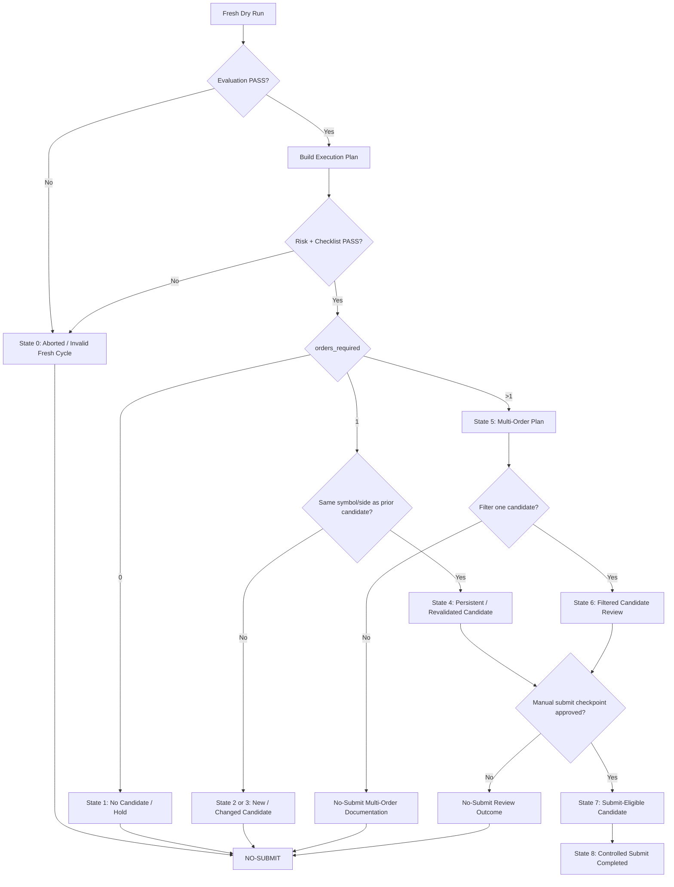

# v1.33 Paper-Trading Decision State Machine

Date: 2026-06-10  
Status: Completed  
Mode: Policy / documentation checkpoint  

## Purpose

Create a formal paper-trading decision state machine that converts fresh PPO paper-trading outputs into controlled operational states.

This checkpoint is documentation-only.

No orders were submitted.



## Starting State

```text
git_tag = v1.32-multi-order-filter-precheck-no-filter-no-submit
tests = 210 passed, 2 warnings
```

## File Added

```text
docs/workflows/paper_trading_decision_state_machine.md
```

## State Machine Scope

The state machine classifies paper-trading runs into:

```text
aborted / invalid fresh cycle
no candidate / hold
single new candidate
changed candidate
persistent / revalidated candidate
multi-order plan
filtered candidate review
submit-eligible candidate
controlled submit completed
```

## Key Decision

Default action is:

```text
NO-SUBMIT
```

Controlled submit is the exception and requires a separate checkpoint, a fresh valid plan, manual approval, exact run-dir confirmation, and broker verification.

## Historical Cases Captured

```text
v1.27 = UNH sell single-candidate review / no-submit
v1.28 = changed candidate, UNH sell became AMD buy / no-submit
v1.30 = multi-order plan, PFE buy + UNH sell / no-submit
v1.32 = no candidate / hold, orders_required = 0 / no-submit
```

## Guardrails Preserved

The state machine preserves the existing safety stack:

```text
evaluation must pass
risk controls must pass
checklist must pass
plan must be fresh
broker open orders must be zero
submit mode must require exact run-dir confirmation
changed candidates default to no-submit
multi-order plans default to no-submit
filtered reviews are review-only
```

## Interpretation

v1.33 converts the prior operational policies into a single decision framework.
The system now has a clear supervised decision path from fresh model output to no-submit, review-only, or controlled-submit eligibility.
No trade approval is automatic.

## Next Step

Recommended next checkpoint:

```text
v1.34 State Machine Dry-Run Classification Utility
```

Purpose: create a small utility that reads execution_plan_summary.json, execution_plan.csv, risk/checklist outputs, and prior-candidate metadata, then prints the correct decision state.
