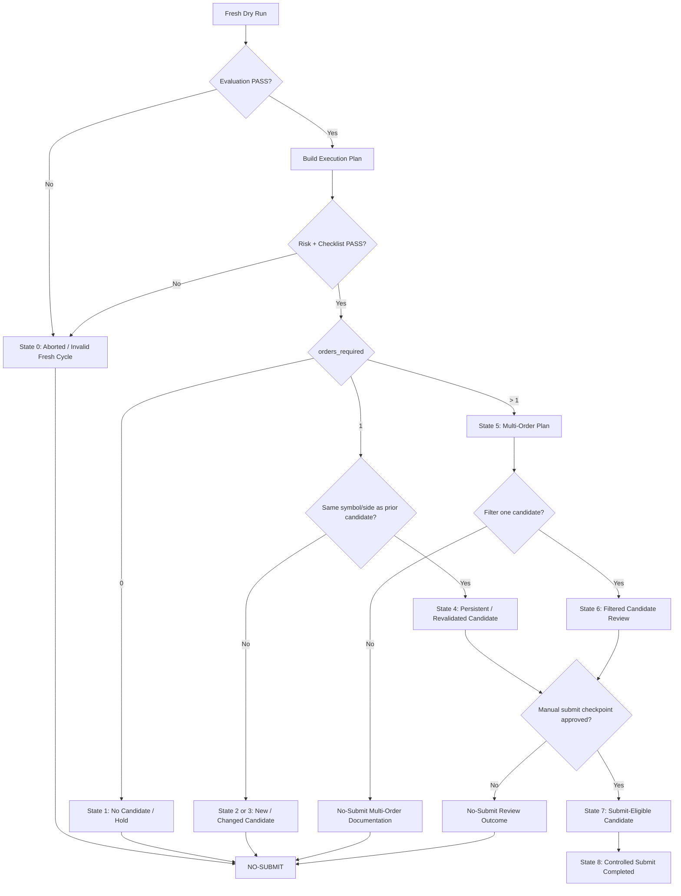

# Paper-Trading Decision State Machine

Version: v1.33  
Status: Active policy  
Scope: PPO-only Alpaca supervised paper trading  
Mode: Policy / operational control  

## Purpose

This document defines the paper-trading decision state machine used to classify fresh PPO paper-trading execution plans.

The state machine converts raw paper-trading outputs into controlled operational decisions.

It does not approve trades automatically.

## Core Principle

A model signal is not a trade approval.

Every fresh run must be classified before any future controlled submit can be considered.

Default action is:

```text
NO-SUBMIT
```

## Inputs

The state machine uses the following artifacts:

```text
dry_run_summary.json
dry_run_targets.csv
execution_plan_summary.json
execution_plan.csv
risk_controls report
paper_order_run_summary.json
pre_trade_checklist_report.json
broker state before / after
```

## Required Pre-Conditions

Before classification, the fresh run must satisfy:

```text
Evaluation result = PASS
predict_ok_count = expected universe size
error_count = 0
Risk result = PASS
Checklist result = PASS
plan_not_stale = PASS
execution_plan_not_stale = PASS
orders_submitted = 0
submit_orders = False
broker_open_orders_zero = PASS
```

If any required pre-condition fails, the state is:

```text
ABORTED / INVALID FRESH CYCLE
```

Decision:

```text
NO-SUBMIT
```

## State Definitions

### State 0: Aborted / Invalid Fresh Cycle

Condition:

```text
evaluation fails
dry-run errors exist
missing bars exist
risk controls fail
checklist fails
plan is stale
broker check fails
```

Decision:

```text
NO-SUBMIT
```

Allowed action:

```text
document aborted run
rerun later when data is valid
```

### State 1: No Candidate / Hold

Condition:

```text
orders_required = 0
buy_count = 0
sell_count = 0
```

Decision:

```text
NO-SUBMIT
NO-FILTER
```

Allowed action:

```text
document hold state
do not create filtered directory
do not force a trade
```

### State 2: Single New Candidate

Condition:

```text
orders_required = 1
candidate does not match prior stable candidate
```

Decision:

```text
NO-SUBMIT
REVIEW ONLY
```

Allowed action:

```text
document candidate
optionally create single-order review directory
require future revalidation
```

### State 3: Changed Candidate

Condition:

```text
candidate symbol changed
candidate side changed
prior candidate disappeared
candidate became below_min_notional
prior single candidate became multi-order
```

Decision:

```text
NO-SUBMIT
```

Allowed action:

```text
document changed signal
do not submit changed candidate
require fresh future review
```

### State 4: Persistent / Revalidated Candidate

Condition:

```text
same symbol and side appears on a later fresh run
orders_required = 1
risk controls pass
checklist passes
```

Decision:

```text
ELIGIBLE FOR CONTROLLED SUBMIT REVIEW
NOT AUTOMATIC APPROVAL
```

Allowed action:

```text
document persistence
prepare separate controlled submit decision checkpoint
```

### State 5: Multi-Order Plan

Condition:

```text
orders_required > 1
```

Decision:

```text
NO-SUBMIT
```

Allowed action:

```text
document multi-order plan
do not submit directly
optionally filter one candidate in a later no-submit review checkpoint
```

### State 6: Filtered Candidate Review

Condition:

```text
multi-order plan reduced to one candidate
filtered run directory exists
risk controls rerun on filtered directory
checklist rerun on filtered directory
submit_orders = False
orders_submitted = 0
```

Decision:

```text
NO-SUBMIT
REVIEW ONLY
```

Allowed action:

```text
document filtered candidate
do not treat filter as trade approval
```

### State 7: Submit-Eligible Candidate

Condition:

```text
candidate is freshly validated
single-order run directory exists
risk controls pass
checklist passes
plan is fresh
broker open orders = 0
manual approval exists
checkpoint is explicitly submit-enabled
```

Decision:

```text
ELIGIBLE FOR CONTROLLED SUBMIT CHECKPOINT
```

Allowed action:

```text
submit exactly one paper order only in a separate controlled submit checkpoint
```

### State 8: Controlled Submit Completed

Condition:

```text
--submit-orders used
--confirm-run-dir used
exact reviewed run directory confirmed
orders_submitted = 1
broker checked after submit
result documented
```

Decision:

```text
SUBMIT COMPLETED
MONITOR REQUIRED
```

Allowed action:

```text
post-submit broker verification
post-submit monitoring
documentation
```

## State Transition Diagram



## Decision Table

| State | Condition | Decision | Submit Allowed |
| --- | --- | --- | --- |
| Aborted / Invalid | Evaluation, risk, checklist, stale, or broker failure | NO-SUBMIT | No |
| No Candidate / Hold | `orders_required = 0` | NO-SUBMIT | No |
| Single New Candidate | One new candidate appears | Review only | No |
| Changed Candidate | Candidate changed from prior run | NO-SUBMIT | No |
| Persistent Candidate | Same symbol/side reappears | Controlled review eligible | Not yet |
| Multi-Order Plan | `orders_required > 1` | NO-SUBMIT | No |
| Filtered Candidate Review | One candidate filtered from multi-order plan | Review only | No |
| Submit-Eligible Candidate | Fresh, reviewed, manual approval, exact run-dir confirmed | Submit checkpoint eligible | Yes, paper only |
| Controlled Submit Completed | One paper order submitted and verified | Monitor | Already completed |

## Historical Examples

### v1.27

```text
State = Single Candidate Review
candidate = UNH sell
decision = NO-SUBMIT
```

### v1.28

```text
Prior candidate = UNH sell
Fresh candidate = AMD buy
State = Changed Candidate
decision = NO-SUBMIT
```

### v1.30

```text
Fresh candidates = PFE buy + UNH sell
orders_required = 2
State = Multi-Order Plan
decision = NO-SUBMIT
```

### v1.32

```text
orders_required = 0
State = No Candidate / Hold
decision = NO-SUBMIT
```

## Guardrails

Never submit from:

```text
aborted runs
stale plans
changed candidates
multi-order plans
filtered-review-only checkpoints
documentation-only checkpoints
plans with broker open orders
plans without manual approval
```

A controlled submit must always require:

```text
fresh dry run
evaluation pass
risk controls pass
checklist pass
single-order run directory
--max-plan-age-minutes 90
--confirm-run-dir <exact reviewed run dir>
manual approval
broker verification after submit
documentation
```

## Policy Decision

The paper-trading state machine makes no-submit the default and controlled submit the exception.
This protects the system from stale plans, unstable signals, changed candidates, and accidental multi-order execution.

## Next Step

Recommended next checkpoint:

```text
v1.34 State Machine Dry-Run Classification Utility
```

Purpose: create a small script or report that reads execution-plan outputs and prints the state-machine classification automatically.
